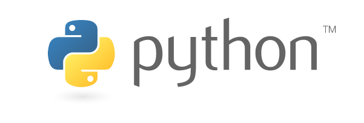

::: center
{fig-align="center" width="200" text-align="center"}
:::

## Objetivos de esta lección

Al terminar esta lección podrás:

- Explicar qué es Python y para qué se usa
- Contar la historia detrás del lenguaje
- Entender la filosofía Zen de Python
- Identificar las áreas donde Python domina

## ¿Qué es Python? — La analogía del multiherramienta

Imagina que vas a armar un mueble. Necesitas:

- **Destornillador** para los tornillos
- **Llave inglesa** para las tuercas
- **Martillo** para los clavos
- **Nivel** para que quede derecho

Eso son los lenguajes de programación especializados. C es como un destornillador profesional — hace UNA cosa extremadamente bien. Java es como una llave inglesa ajustable — versátil pero pesada.

**Python es como un multiherramienta Swiss Army**. No es el mejor destornillador del mundo, pero puedes hacer el 90% del trabajo con una sola herramienta. Y eso lo hace increíblemente valioso.

## Historia rápida

| Año | Evento |
|-----|--------|
| 1989 | Guido van Rossum empieza a trabajar en Python durante las vacaciones de Navidad en Holanda |
| 1991 | Se publica Python 0.9.0 — ya tenía clases, herencia y manejo de excepciones |
| 2000 | Python 2.0 — list comprehensions, garbage collector |
| 2008 | Python 3.0 — ruptura con Python 2, diseño más limpio |
| 2020 | Python 2 llega a su fin — Python 3 es el estándar |
| 2024 | Python es el lenguaje #1 en el ranking TIOBE |

> **Dato curioso:** El nombre NO viene de la serpiente. Guido era fanático del grupo de comedia británico **Monty Python**. Por eso los ejemplos oficiales hablan de "spam" y "eggs".

## ¿Para qué se usa Python?

Python está en todas partes. Literalmente.

### 🌐 Desarrollo Web
- **Django** y **Flask** — frameworks para crear sitios web
- Instagram, Pinterest, Spotify usan Python en su backend

### 🤖 Inteligencia Artificial
- **TensorFlow**, **PyTorch** — las bibliotecas de IA más usadas del mundo
- ChatGPT, Midjourney, y todos los modelos de IA usan Python

### 📊 Ciencia de Datos
- **pandas**, **numpy**, **matplotlib** — análisis y visualización
- Empresas como Netflix y Uber toman decisiones con datos en Python

### 🔧 Automatización
- Scripts para tareas repetitivas
- DevOps, testing, deployment

### 🎮 Desarrollo de Juegos
- **Pygame** — biblioteca para crear juegos 2D
- Herramientas de desarrollo como Blender usan Python

### 🔐 Ciberseguridad
- Herramientas de pentesting como **Scapy**
- Scripts de automatización de pruebas de seguridad

### 🗄️ Bases de Datos
- **SQLite** — base de datos incluida en Python (no requiere instalación)
- **SQLAlchemy** — ORM para PostgreSQL, MySQL, MariaDB
- **psycopg2** — driver para PostgreSQL
- **pymysql** — driver para MySQL/MariaDB

## La filosofía de Python: El Zen

Python tiene una filosofía escrita. Se llama **"El Zen de Python"** y puedes leerla directamente en tu computadora:

```python
import this # <1>
```

1. El módulo `**this**` contiene el Zen de Python. Al importarlo, se imprime en pantalla automáticamente.

Los principios más importantes:

1. **"Beautiful is better than ugly"** — El código bonito es mejor que el feo
2. **"Simple is better than complex"** — Simple es mejor que complejo
3. **"Readability counts"** — La legibilidad importa
4. **"There should be one-- and preferably only one --obvious way to do it"** — Debe haber una forma obvia de hacer las cosas

Esto significa que en Python, **escribimos código para que los humanos lo lean**, no las máquinas.

## Python vs otros lenguajes — Comparación rápida

### Imprimir "Hola Mundo"

**Python:**

```python
print("Hola Mundo") # <1>
```

1. En Python, una sola línea de código es suficiente para imprimir texto en pantalla.

**Java:**

```java
public class HolaMundo {
    public static void main(String[] args) {
        System.out.println("Hola Mundo");
    }
}
```

**C++:**

```cpp
#include <iostream>
int main() {
    std::cout << "Hola Mundo" << std::endl;
    return 0;
}
```

¿Ves la diferencia? Python te deja **ir al grano**.

## ¿Por qué Python para principiantes?

1. **Sintaxis limpia** — Se lee como inglés básico
2. **Tipado dinámico** — No necesitas declarar tipos de variables
3. **Comunidad enorme** — Si tienes un problema, alguien ya lo resolvió
4. **Versátil** — Aprendes un lenguaje y puedes hacer de todo
5. **Demanda laboral** — Es el lenguaje más solicitado en ofertas de trabajo

## Resumen

| Concepto | Idea clave |
|----------|------------|
| ¿Qué es? | Lenguaje de programación de alto nivel, interpretado y multipropósito |
| ¿Quién lo creó? | Guido van Rossum, 1989 |
| ¿Por qué Python? | Sintaxis simple, versátil, enorme comunidad |
| ¿Para qué sirve? | Web, IA, datos, automatización, juegos, seguridad, bases de datos |
| Filosofía | Código legible, simple y hermoso |

---

**Siguiente:** [1.2 Instalación y configuración](02-instalacion.qmd)
