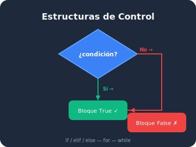

## 🎯 Objetivos del Módulo

Al completar este módulo, serás capaz de:

- ✅ Tomar decisiones en tu código con `if`, `elif` y `else`
- ✅ Repetir acciones con `for` y `while` de forma eficiente
- ✅ Controlar el flujo de bucles con `break` y `continue`
- ✅ Escribir código compacto y elegante con comprensiones de listas
- ✅ Elegir la estructura correcta para cada problema

## 📚 Contenido

| Lección | Tema | Tipo |
|---------|------|------|
| [3.1](01-if-else.qmd) | if / else: el semáforo del código | 📖 Teoría |
| [3.2](02-if-anidado.qmd) | Decisiones anidadas: capas de lógica | 📖 Teoría |
| [3.3](03-for-loop.qmd) | for: el bucle que cuenta por ti | 🚀 Acción |
| [3.4](04-while-loop.qmd) | while: repetir mientras se cumpla | 🚀 Acción |
| [3.5](05-break-continue.qmd) | break y continue: control total | 💻 Práctica |
| [3.6](06-comprension-listas.qmd) | Comprensión de listas: elegancia Python | ✨ Avanzado |
| [Resumen](99-resumen.qmd) | Resumen y autoevaluación | 📋 Cierre |

## 🏆 Desafíos del Módulo

| # | Desafío | Dificultad |
|---|---------|------------|
| [1](desafio-01-par-o-impar.qmd) | Par o impar | ⭐ Fácil |
| [2](desafio-02-tabla-multiplicar.qmd) | Tabla de multiplicar | ⭐ Fácil |
| [3](desafio-03-fizzbuzz.qmd) | FizzBuzz clásico | ⭐⭐ Media |
| [4](desafio-04-adivina-numero.qmd) | Adivina el número | ⭐⭐ Media |
| [5](desafio-05-piedra-papel-tijera.qmd) | Piedra, papel o tijera | ⭐⭐ Media |
| [6](desafio-06-generador-contrasenas.qmd) | Generador de contraseñas | ⭐⭐⭐ Difícil |
| [7](desafio-07-cajero-automatico.qmd) | Cajero automático | ⭐⭐⭐ Difícil |

---

**Anterior:** [Módulo 2: Tipos de Datos y Variables](../modulo-02/index.qmd) |
**Siguiente:** [3.1 if / else](01-if-else.qmd)
