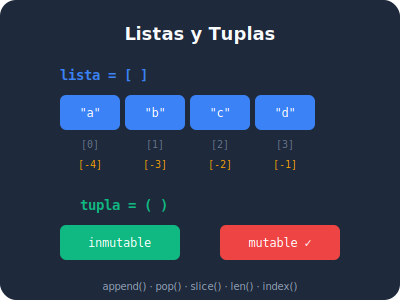

## Objetivos de esta lección

- Entender qué es una lista y por qué es la estructura más usada en Python
- Crear listas con diferentes tipos de datos
- Comprender la diferencia entre una variable simple y una colección
- Usar `list()` y `range()` para generar listas automáticamente

## ¿Qué es una lista?

Imagina que tienes una **lista de compras** en tu teléfono. No es un solo producto — es una **colección ordenada** de cosas que necesitas. En Python, las listas hacen exactamente eso: guardan múltiples valores en un solo lugar, manteniendo el orden en que los pusiste.

```python
# Una variable normal guarda UN solo valor
producto = "leche" # <1>

# Una lista guarda MUCHOS valores en orden
compras = ["leche", "pan", "huevos", "café"] # <2>
```

1. Una variable simple solo puede tener un valor a la vez. Si asignas otro, el anterior se pierde.
2. Una lista puede contener muchos valores, y todos se mantienen accesibles por su posición.

> **There should be one obvious way to do it.** Si necesitas guardar varios valores relacionados, la lista es tu primera opción en Python.



## Tu primera lista

Crear una lista es tan simple como poner valores entre corchetes `[]`, separados por comas:

```python
# Lista de lenguajes de programación
lenguajes = ["Python", "JavaScript", "Go", "Rust"] # <1>

# Lista de números
notas = [8.5, 9.0, 7.5, 10.0, 6.5] # <2>

# Lista vacía — útil cuando vas a llenarla después
pendientes = [] # <3>

# Puedes ver cuántos elementos tiene con len()
print(len(lenguajes)) # <4>
print(len(pendientes)) # <5>
```

1. Los corchetes `[]` crean una lista. Cada valor entre comas es un **elemento** de la lista.
2. Las listas pueden contener cualquier tipo de dato. Esta lista tiene números decimales (`float`).
3. `[]` es una lista vacía. Es como tener una caja sin nada adentro — lista para usar.
4. `len(lenguajes)` devuelve `4` porque hay 4 elementos en la lista.
5. `len(pendientes)` devuelve `0` porque la lista está vacía.

## Listas mixtas: diferentes tipos en un solo lugar

A diferencia de otros lenguajes, Python te permite mezclar tipos en la misma lista. No es lo más común, pero es posible:

```python
# ✅ Python permite mezclar tipos
perfil = ["Ana", 28, True, 1.65] # <1>

# Cada elemento tiene un tipo diferente
print(type(perfil[0])) # <2>
print(type(perfil[1])) # <3>
print(type(perfil[2])) # <4>
print(type(perfil[3])) # <5>
```

1. `perfil` contiene un `str`, un `int`, un `bool` y un `float` — todos en la misma lista.
2. `perfil[0]` es `"Ana"` — tipo `str`.
3. `perfil[1]` es `28` — tipo `int`.
4. `perfil[2]` es `True` — tipo `bool`.
5. `perfil[3]` es `1.65` — tipo `float`.

> **Practicality beats purity.** Mezclar tipos es útil para datos simples, pero para estructuras complejas es mejor usar diccionarios o clases (lo verás en módulos futuros).

## La función list(): convertir a lista

Puedes crear una lista a partir de otros tipos de datos usando `list()`:

```python
# De texto a lista de caracteres
palabra = "Python" # <1>
letras = list(palabra) # <2>
print(letras)

# De rango a lista de números
numeros = list(range(5)) # <3>
print(numeros)

# De tupla a lista (las tuplas son inmutables, las listas no)
tupla = (1, 2, 3) # <4>
desde_tupla = list(tupla) # <5>
print(desde_tupla)
```

1. Un `str` es una secuencia de caracteres. Python puede tratarlo como tal.
2. `list("Python")` crea `['P', 'y', 't', 'h', 'o', 'n']` — cada carácter es un elemento.
3. `range(5)` genera números del 0 al 4. `list()` los convierte en `[0, 1, 2, 3, 4]`.
4. Una tupla es como una lista pero inmutable (no se puede modificar). La veremos en detalle después.
5. `list((1, 2, 3))` crea `[1, 2, 3]` — la tupla se convierte en lista mutable.

## range(): generar secuencias numéricas

`range()` es tu aliado cuando necesitas secuencias de números. No crea una lista directamente — crea un **objeto rango** que genera números bajo demanda:

```python
# range(stop) — del 0 hasta stop-1
for i in range(5): # <1>
    print(i, end=" ")

print()

# range(start, stop) — del start hasta stop-1
for i in range(3, 8): # <2>
    print(i, end=" ")

print()

# range(start, stop, step) — con paso personalizado
for i in range(0, 20, 4): # <3>
    print(i, end=" ")

print()

# Contar hacia atrás
for i in range(10, 0, -2): # <4>
    print(i, end=" ")
```

1. `range(5)` genera: 0, 1, 2, 3, 4. El 5 NO se incluye.
2. `range(3, 8)` genera: 3, 4, 5, 6, 7. Empieza en 3, termina antes de 8.
3. `range(0, 20, 4)` genera: 0, 4, 8, 12, 16. El `4` es el paso (salta de 4 en 4).
4. `range(10, 0, -2)` genera: 10, 8, 6, 4, 2. El paso negativo cuenta hacia atrás.

## ¿Cuándo usar una lista?

| Situación | ¿Usar lista? | Por qué |
|-----------|:------------:|---------|
| Guardar las notas de un estudiante | ✅ Sí | Necesitas varios valores del mismo tipo |
| Almacenar un nombre | ❌ No | Un `str` es suficiente |
| Guardar coordenadas (x, y) | ⚠️ Depende | Si no cambian, mejor tupla |
| Lista de tareas pendientes | ✅ Sí | Agregas y quitas elementos frecuentemente |
| Los días de la semana | ⚠️ Depende | Si no cambian, mejor tupla |
| Historial de transacciones | ✅ Sí | Crece con el tiempo, necesitas orden |

> **Explicit is better than implicit.** Si los datos van a cambiar (agregar, quitar, modificar), usa lista. Si son fijos e inmutables, usa tupla.

## Errores comunes al crear listas

```python
# ❌ Olvidar las comas entre elementos
# colores = ["rojo" "verde" "azul"] # <1>

# ✅ Comas entre todos los elementos
colores = ["rojo", "verde", "azul"] # <2>

# ❌ Usar paréntesis en vez de corchetes
# mi_lista = (1, 2, 3) # <3>

# ✅ Corchetes para listas
mi_lista = [1, 2, 3] # <4>

# ❌ Lista con variable no definida
# items = [a, b, c] # <5>

# ✅ Strings entre comillas
items = ["a", "b", "c"] # <6>
```

1. Sin comas, Python concatena los strings: `"rojo" "verde" "azul"` se convierte en `"rojoverdeazul"`. No es un error de sintaxis, pero probablemente no es lo que querías.
2. Con comas, cada color es un elemento separado: `['rojo', 'verde', 'azul']`.
3. Los paréntesis `()` crean una **tupla**, no una lista. Las tuplas son inmutables.
4. Los corchetes `[]` crean una **lista** mutable que puedes modificar.
5. Python busca variables llamadas `a`, `b`, `c`. Si no existen, obtienes `NameError`.
6. Las comillas indican que son strings, no variables.

## Resumen

| Concepto | Ejemplo | Principio del Zen |
|----------|---------|-------------------|
| Lista con corchetes | `["a", "b", "c"]` | Simple is better than complex |
| Lista vacía | `[]` | Explicit is better than implicit |
| `list()` para convertir | `list("abc")` | There should be one obvious way |
| `range()` para secuencias | `list(range(5))` | Practicality beats purity |
| Mezclar tipos | `["Ana", 28, True]` | Practicality beats purity |

---

**Anterior:** [Módulo 4](../modulo-04/index.qmd) | **Siguiente:** [5.2 Indexar y slicing](02-indexar-slicing.qmd)
