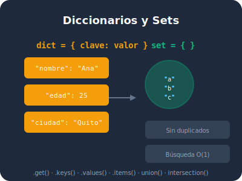

## Objetivos de esta lección

- Entender qué es un diccionario y por qué se llama así
- Crear diccionarios con la sintaxis de llaves `{}`
- Usar `dict()` como alternativa de creación
- Comprender qué tipos pueden ser claves
- Elegir entre lista y diccionario según la situación

## ¿Qué es un diccionario?

Imagina una **agenda de contactos**. No buscas a alguien por su posición (el tercero de la lista), sino por su **nombre**. Dices "busca a Ana" y la agenda te devuelve su teléfono, su email, su dirección.

Un diccionario en Python funciona exactamente así: guardas datos asociados a una **clave** única, y los recuperas usando esa clave.

```python
# Una lista: buscas por posición
contactos = ["Ana", "Carlos", "Diego"]  # <1>
print(contactos[0])  # ¿Quién es el primero?

# Un diccionario: buscas por nombre
agenda = {
    "Ana": "0987654321",
    "Carlos": "0991234567",
    "Diego": "0963456789"
}  # <2>
print(agenda["Ana"])  # ¿Cuál es el teléfono de Ana?
```

1. En una lista, accedes por **posición** (índice). Si no sabes en qué posición está Ana, debes recorrer toda la lista.
2. En un diccionario, accedes por **clave**. No importa cuántos contactos haya, `"Ana"` siempre te devuelve su teléfono directamente.

> **Beautiful is better than ugly.** Un diccionario organiza datos de forma que el código se lee como una consulta natural: "dame el teléfono de Ana".



## Anatomía de un diccionario

Un diccionario es una colección de **pares clave-valor** separados por comas, envueltos en llaves `{}`.

```python
# Estructura básica de un diccionario
persona = {
    "nombre": "Ana",       # <1>
    "edad": 28,            # <2>
    "ciudad": "Quito",     # <3>
    "es_estudiante": True  # <4>
}
```

1. `"nombre"` es la **clave** (siempre un string). `"Ana"` es el **valor** asociado.
2. `"edad"` es la clave. `28` es el valor (puede ser cualquier tipo).
3. `"ciudad"` es la clave. `"Quito"` es el valor.
4. `"es_estudiante"` es la clave. `True` es el valor booleano.

Cada par clave-valor se separa con dos puntos `:`. Cada par se separa del siguiente con una coma `,`.

## Dos formas de crear diccionarios

### Forma 1: Llaves `{}` (la más común)

```python
# ✅ Forma recomendada: clara y directa
producto = {
    "nombre": "Laptop",
    "precio": 999.99,
    "stock": 15
}  # <1>

# Diccionario vacío
carrito = {}  # <2>
```

1. Las llaves `{}` con pares `clave: valor` son la forma más legible y usada en Python.
2. `{}` crea un diccionario vacío. Es el punto de partida para construir diccionarios dinámicamente.

### Forma 2: `dict()` (útil en casos especiales)

```python
# Usando dict() con argumentos con nombre
config = dict(
    host="localhost",
    puerto=8080,
    debug=True
)  # <1>

# Usando dict() con lista de tuplas
datos = dict([
    ("nombre", "Ana"),
    ("edad", 28)
])  # <2>
```

1. `dict()` con argumentos con nombre es útil cuando las claves son identificadores válidos (sin espacios ni caracteres especiales).
2. `dict()` con lista de tuplas es útil cuando los datos vienen de otra fuente (como una consulta a base de datos).

> **There should be one obvious way to do it.** En la práctica, el 95% de las veces usarás `{}`. Usa `dict()` solo cuando tenga sentido.

## Las claves: reglas de oro

No todo puede ser una clave. Las claves deben ser **inmutables** — no pueden cambiar después de crearse.

```python
# ✅ Claves válidas (inmutables)
diccionario = {
    "nombre": "Ana",      # <1>
    42: "respuesta",      # <2>
    (1, 2): "coordenada", # <3>
    True: "verdadero",    # <4>
}

# ❌ Claves inválidas (mutables)
# diccionario = {
#     [1, 2]: "lista",    # <5>
#     {"a": 1}: "otro",   # <6>
# }
```

1. Los **strings** son las claves más comunes. Son inmutables y descriptivos.
2. Los **enteros** también pueden ser claves. `42` es una clave válida.
3. Las **tuplas** pueden ser claves porque son inmutables. Útil para coordenadas o combinaciones.
4. Los **booleanos** pueden ser claves, aunque es raro verlo en la práctica.
5. Las **listas** NO pueden ser claves porque son mutables (pueden cambiar).
6. Los **diccionarios** NO pueden ser claves porque también son mutables.

> **Explicit is better than implicit.** Si intentas usar una lista como clave, Python te dará un error claro: `TypeError: unhashable type: 'list'`.

## ¿Lista o diccionario?

Esta es la pregunta que todo principiante se hace. Aquí tienes la regla:

| Situación | Estructura | ¿Por qué? |
|-----------|------------|-----------|
| Orden importa | Lista `[]` | Necesitas el primer, segundo, tercer elemento |
| Búsqueda por nombre | Diccionario `{}` | Buscas por clave, no por posición |
| Colección simple | Lista `[]` | Solo necesitas guardar valores |
| Datos con atributos | Diccionario `{}` | Cada valor tiene un significado |
| Secuencia de pasos | Lista `[]` | El orden es fundamental |
| Configuración | Diccionario `{}` | Cada ajuste tiene un nombre |

```python
# ✅ Lista: el orden importa
semana = ["lunes", "martes", "miércoles", "jueves", "viernes"]  # <1>

# ✅ Diccionario: cada valor tiene un nombre
temperaturas = {
    "lunes": 22,
    "martes": 25,
    "miércoles": 19
}  # <2>
```

1. La semana tiene un orden natural. El lunes siempre va primero. Una lista es perfecta.
2. Las temperaturas tienen un nombre (el día) asociado a un valor. Un diccionario es perfecto.

> **Practicality beats purity.** No hay una respuesta absoluta. Elige la estructura que haga tu código más fácil de leer y mantener.

## Diccionario con valores de diferentes tipos

Un diccionario puede mezclar tipos en sus valores sin problema:

```python
# Un diccionario con valores de distintos tipos
estudiante = {
    "nombre": "Carlos",         # <1> str
    "edad": 22,                  # <2> int
    "promedio": 9.2,             # <3> float
    "aprobado": True,            # <4> bool
    "materias": ["Math", "CS"],  # <5> list
    "direccion": None            # <6> NoneType
}
```

1. `"Carlos"` es un string — el nombre del estudiante.
2. `22` es un entero — la edad.
3. `9.2` es un float — el promedio con decimales.
4. `True` es un booleano — indica si aprobó o no.
5. `["Math", "CS"]` es una lista — las materias inscritas.
6. `None` indica que la dirección aún no se ha registrado.

## Resumen

| Concepto | Sintaxis | Ejemplo |
|----------|----------|---------|
| Crear diccionario | `{clave: valor}` | `{"nombre": "Ana"}` |
| Diccionario vacío | `{}` o `dict()` | `datos = {}` |
| Clave válida | String, int, tuple | `"edad"`, `42`, `(1,2)` |
| Clave inválida | List, dict | `[1,2]`, `{"a":1}` |
| Múltiples tipos | Cualquier valor | `{"x": 1, "y": "hola"}` |

| Principio del Zen | Cómo aplica |
|-------------------|-------------|
| Beautiful is better than ugly | Diccionarios hacen el código autoexplicativo |
| Explicit is better than implicit | Las claves nombran claramente cada dato |
| Readability counts | `persona["nombre"]` se lee como lenguaje natural |

---

**Anterior:** [Módulo 6: Inicio](index.qmd) | **Siguiente:** [6.2 Acceder y modificar](02-acceder-modificar.qmd)
