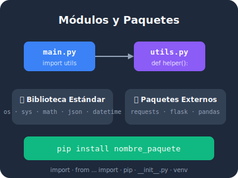

## 🎯 Objetivos del Módulo

Al completar este módulo, serás capaz de:

- ✅ Importar y usar módulos de la biblioteca estándar de Python
- ✅ Crear tus propios módulos reutilizables
- ✅ Organizar código en paquetes con `__init__.py`
- ✅ Instalar paquetes de terceros con `pip`
- ✅ Crear y gestionar entornos virtuales
- ✅ Elegir el módulo correcto para cada tarea

## 📚 Contenido

| Lección | Tema | Tipo |
|---------|------|------|
| [8.1](01-importar-modulos.qmd) | Importar módulos: tu caja de herramientas | 📖 Teoría |
| [8.2](02-modulos-estandar.qmd) | La biblioteca estándar: módulos que ya tienes | 📖 Teoría |
| [8.3](03-crear-modulos.qmd) | Crear tus propios módulos | 💻 Práctica |
| [8.4](04-paquetes.qmd) | Paquetes: organizar código profesionalmente | 📖 Teoría |
| [8.5](05-pip-paquetes.qmd) | pip: el gestor de paquetes de Python | 💻 Práctica |
| [8.6](06-entornos-virtuales.qmd) | Entornos virtuales: aislamiento seguro | 💻 Práctica |
| [Resumen](99-resumen.qmd) | Resumen y autoevaluación | 📋 Cierre |

## 🏆 Desafíos del Módulo

| # | Desafío | Dificultad |
|---|---------|------------|
| [1](desafio-01-mi-primer-modulo.qmd) | Mi primer módulo | ⭐ Fácil |
| [2](desafio-02-generador-fechas.qmd) | Generador de fechas | ⭐ Fácil |
| [3](desafio-03-aleatorios-avanzados.qmd) | Aleatorios avanzados | ⭐⭐ Media |
| [4](desafio-04-organizador-archivos.qmd) | Organizador de archivos | ⭐⭐ Media |
| [5](desafio-05-api-clima.qmd) | API del clima | ⭐⭐ Media |
| [6](desafio-06-web-scraper.qmd) | Web scraper | ⭐⭐⭐ Difícil |
| [7](desafio-07-proyecto-modular.qmd) | Proyecto modular completo | ⭐⭐⭐ Difícil |

---

**Anterior:** [Módulo 7](../modulo-07/index.qmd) | **Siguiente:** [8.1 Importar módulos](01-importar-modulos.qmd)
