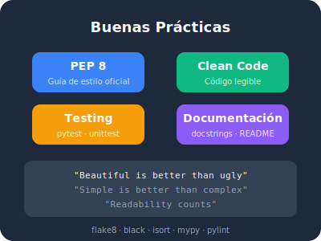

## 🎯 Objetivos del Módulo

Al completar este módulo, serás capaz de:

- ✅ Escribir código Python siguiendo la guía de estilo PEP 8
- ✅ Elegir nombres descriptivos que comuniquen intención sin comentarios
- ✅ Diseñar funciones puras y predecibles
- ✅ Manejar errores con elegancia usando `try/except`
- ✅ Documentar tu código con docstrings profesionales
- ✅ Escribir tests básicos con `pytest` para validar tu código

## 📚 Contenido

| Lección | Tema | Tipo |
|---------|------|------|
| [9.1](01-pep8-estilo.qmd) | PEP 8: el estilo que une a la comunidad | 📖 Teoría |
| [9.2](02-nombres-descriptivos.qmd) | Nombres descriptivos: código que habla | 📖 Teoría |
| [9.3](03-funciones-puras.qmd) | Funciones puras: predecibles y testeables | 📖 Teoría |
| [9.4](04-manejo-errores.qmd) | Manejo de errores: falla con elegancia | 💻 Práctica |
| [9.5](05-documentacion.qmd) | Documentación: tu yo del futuro te lo agradecerá | 📖 Teoría |
| [9.6](06-testing-basico.qmd) | Testing básico: confianza en tu código | 🚀 Acción |
| [Resumen](99-resumen.qmd) | Resumen y autoevaluación | 📋 Cierre |

## 🏆 Desafíos del Módulo

| # | Desafío | Dificultad |
|---|---------|------------|
| [1](desafio-01-refactorizar-codigo.qmd) | Refactorizar código desordenado | ⭐ Fácil |
| [2](desafio-02-docstrings.qmd) | Documentar funciones con docstrings | ⭐ Fácil |
| [3](desafio-03-validador-robusto.qmd) | Crear un validador de datos robusto | ⭐⭐ Media |
| [4](desafio-04-test-calculadora.qmd) | Escribir tests para una calculadora | ⭐⭐ Media |
| [5](desafio-05-linter-codigo.qmd) | Corregir errores de un linter | ⭐⭐ Media |
| [6](desafio-06-refactorizar-proyecto.qmd) | Refactorizar un mini proyecto completo | ⭐⭐⭐ Difícil |
| [7](desafio-07-code-review.qmd) | Revisar código de otro programador | ⭐⭐⭐ Difícil |

---

**Anterior:** [Módulo 8](../modulo-08/index.qmd) | **Siguiente:** [9.1 PEP 8: el estilo que une a la comunidad](01-pep8-estilo.qmd)
