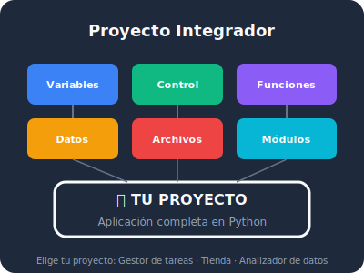

## 🎯 Objetivos del Módulo

Al completar este módulo, serás capaz de:

- ✅ Planificar un proyecto de software desde cero hasta la implementación
- ✅ Estructurar un proyecto Python siguiendo buenas prácticas profesionales
- ✅ Construir una aplicación completa integrando todos los conceptos del curso
- ✅ Presentar tu proyecto con documentación clara y profesional
- ✅ Evaluar tu propio código con criterios de calidad

## 📚 Contenido

| Lección | Tema | Tipo |
|---------|------|------|
| [10.1](01-planificar-proyecto.qmd) | Planificar tu proyecto: del problema a la solución | 📖 Teoría |
| [10.2](02-estructura-proyecto.qmd) | Estructura profesional de un proyecto Python | 💻 Práctica |
| [10.3](03-proyecto-gestor-tareas.qmd) | Proyecto guiado: Gestor de Tareas | 🚀 Acción |
| [10.4](04-proyecto-tienda-simple.qmd) | Proyecto guiado: Tienda de Productos | 🚀 Acción |
| [10.5](05-proyecto-analizador-datos.qmd) | Proyecto guiado: Analizador de Datos | 🚀 Acción |
| [10.6](06-presentacion-proyecto.qmd) | Presentar tu proyecto al mundo | 📋 Cierre |
| [Cierre](99-cierre-curso.qmd) | Cierre del curso y próximos pasos | 🎓 Graduación |

## 🏆 Elige tu Desafío Final

Estos son los proyectos que construirás. **Elige UNO** según tu nivel de ambición:

| # | Proyecto | Dificultad | Qué integras |
|---|----------|------------|--------------|
| [Proyecto 1](proyecto-01-gestor-tareas.qmd) | Gestor de Tareas Personal | ⭐⭐ Media | Variables, funciones, listas, archivos |
| [Proyecto 2](proyecto-02-tienda-productos.qmd) | Tienda de Productos | ⭐⭐⭐ Difícil | Todo lo anterior + diccionarios + búsqueda |
| [Proyecto 3](proyecto-03-analizador-datos.qmd) | Analizador de Datos CSV | ⭐⭐⭐ Difícil | Todo lo anterior + estadísticas + reportes |

## 🗺️ El Camino del Héroe

::: {.callout-tip}
## ¿Por qué un proyecto integrador?

Aprender a programar es como aprender a cocinar. Puedes memorizar recetas individuales, pero **hasta que no cocinas una cena completa para invitados, no sabes si realmente dominas la cocina**.

Este módulo es esa cena. No es una receta más — es el momento donde **tú decides el menú, tú eliges los ingredientes, y tú cocinas**.
:::

{fig-align="center" width="500"}

---

**Anterior:** [Módulo 9: Buenas Prácticas](../modulo-09/index.qmd)

**Siguiente:** [10.1 Planificar tu proyecto](01-planificar-proyecto.qmd)
