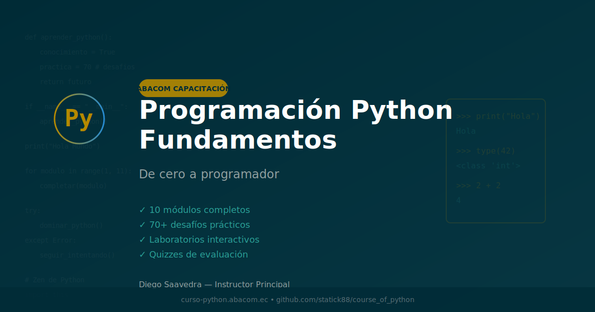

::: {style="text-align: center; margin-top: 10vh;"}

{width="150px"}

\vspace{2cm}

{\Huge \textcolor{#306998}{\textbf{Programación Python Fundamentos}}}

\vspace{0.5cm}

{\LARGE \textcolor{#FFD43B}{De cero a programador}}

\vspace{1cm}

{\Large Aprende Python con desafíos prácticos, laboratorios interactivos y proyectos reales}

\vspace{2cm}

{\Large \textbf{Diego Saavedra}}

\vspace{0.5cm}

{\normalsize Material educativo para \textbf{Abacom Capacitación y Servicios}}

\vspace{0.3cm}

{\small Loja, Ecuador — 2026}

\vspace{2cm}

{width="250px"}

\vspace{2cm}

\rule{\textwidth}{0.5pt}

{\small }

{\scriptsize Esta obra está bajo una licencia [Creative Commons Atribución-NoComercial-CompartirIgual 4.0 Internacional](https://creativecommons.org/licenses/by-nc-sa/4.0/deed.es)}

:::
